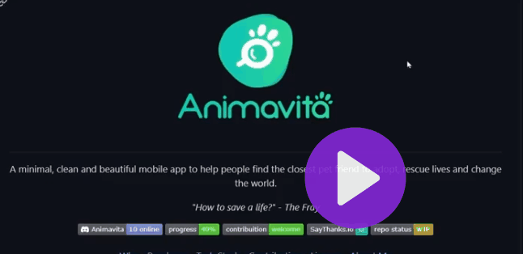

# projeto cm README 
Um projeto de teste cm arquivo README 🐱‍🏍

[] 

## tecnologias ultilizadas
- HTML
- CSS
- JS

## como ultilizar 
clone pro projeto 
```
git clone
```
acesse a pasta do projeto 
```
cd repositorio-com-reame
```


